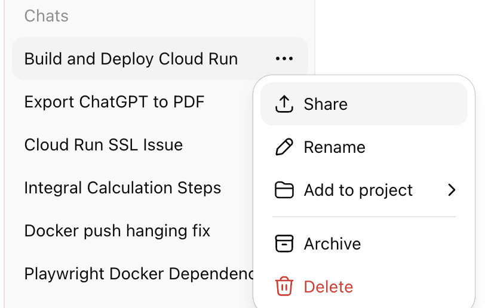
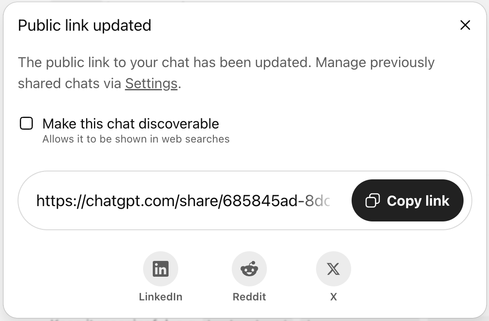

# chatgpt-export

Easy way to export ChatGPT conversations to PDF

URL: https://chatgpt-export.cloudmatica.com/

#### Step 1: Share the conversation in ChatGPT



#### Step 2: Copy the link to the clipboard



#### Step 3: Build URL

Append `/pdf?url=` followed by the ChatGPT url from Step 2. The final URL should look like the following

```
https://chatgpt-export.cloudmatica.com/pdf?url=https://chatgpt.com/share/YOUR_CHATGPT_SHARE_CODE
```

Enter this URL in any web browser to download the PDF
